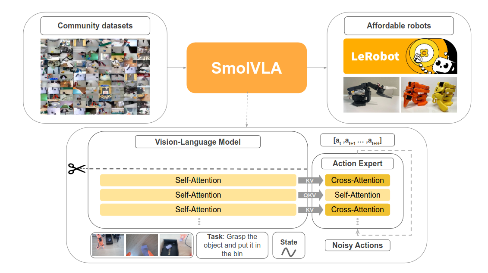
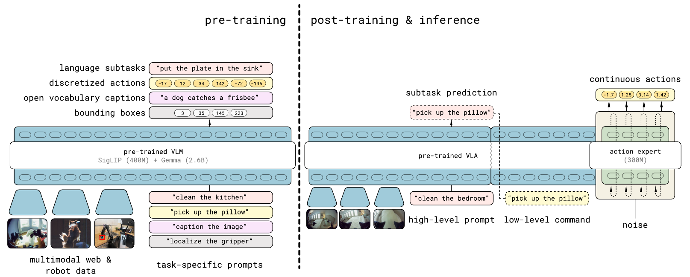
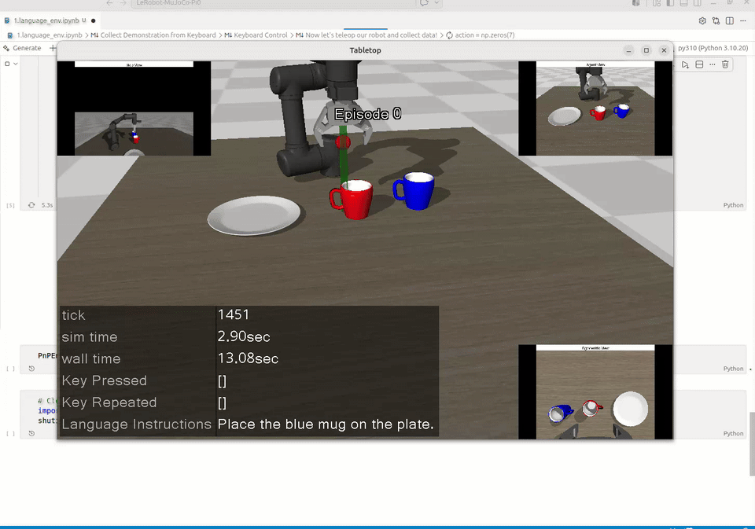
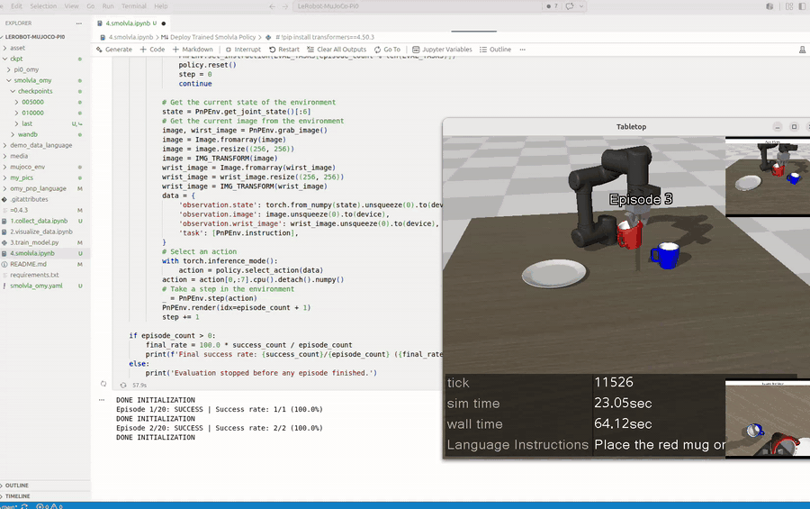
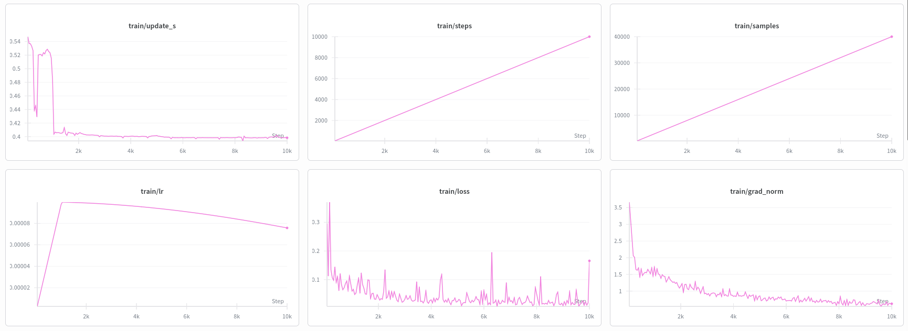
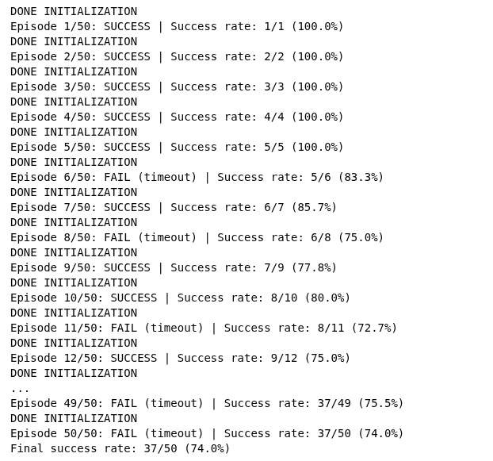

# Training SmolVLA with LeRobot in MuJoCo: Understanding Pi0 and Pi0.5

## Table of Contents
- [📚 Theory](#-theory)
  - [➡️ Pi0](#️-pi0)
    - [1. Pre-trained VLM](#1-pre-trained-vlm)
    - [2. Action Expert](#2-action-expert)
  - [➡️ SmolVLA](#-smolvla)
  - [➡️ Pi0.5](#️-pi05)

- [Setup](#setup)
- [1. Collect Demonstration Data](#1-collect-demonstration-data)
- [2. Playback Your Data](#2-playback-your-data)
- [3. Train SmolVLA](#3-train-smolvla)
- [4. Deploy SmolVLA](#4-deploy-smolvla)
- [Reference](#reference)


## 📚 Theory

### ➡️ Pi0 

**π₀** is a **VLA** model developed by Physical Intelligence for general-purpose robot control.

Unlike ACT, which directly predicts action chunks, π₀ combines a pretrained **VLM** with a specialized **action expert** to generate continuous robot actions.  π₀ is a **single transformer with two sets of weights**.

> [!IMPORTANT]
> **VLM** focuses on **understanding the scene**, while the **Action Expert** determines **how the robot should move**. Their parameters are independent, but they exchange information through the **attention mechanism at each Transformer layer**.

<p align="center">
  
</p>

#### 1. Pre-trained VLM
π₀ builds its VLM backbone on **PaliGemma**, which consists of:

* **SigLIP**: A **ViT (Vision Transformer)** used as the vision encoder. It converts input images into image tokens. A **linear projection layer** then maps these image tokens to the same embedding dimension as the Gemma text tokens, allowing them to be processed together.

* **Gemma**: A **decoder-only Transformer** used as the language-model backbone. It jointly processes the projected image tokens and text tokens to produce contextual visual-language representations.

> [!NOTE]
> **SigLIP**
> Image → Image Tokens
> 
> **Gemma**
> Image Tokens + Text Tokens → Contextual Representations

<p align="center">
  
</p>

#### 2. Action Expert
**🌊conditional flow matching**: random noise -> valid action trajectories.


Instead of directly predicting the final action, the model learns a **vector field** that tells a noisy action in which direction it should move toward the real action.

**Training** 

A noisy action is constructed as:

$$
A_t^\tau = \tau A_t + (1-\tau)\epsilon
$$

where:

- $A_t$: ground-truth action chunk
- $\epsilon \sim \mathcal{N}(0, I)$: random noise
- $\tau \in [0,1]$: flow-matching timestep

Therefore:

$$
\tau=0 \Rightarrow A_t^\tau=\epsilon
$$

while:

$$
\tau=1 \Rightarrow A_t^\tau=A_t
$$

is the real action.

The model learns:

$$
v_\theta(A_t^\tau,o_t)
$$

which predicts the direction in which the noisy action should move. In π₀, the training goal is:

$$
v_\theta(A_t^\tau,o_t)\approx A_t-\epsilon
$$

**Inference**

At inference time, π₀ starts from random noise:

$$
A_t^0\sim\mathcal N(0,I)
$$

and repeatedly updates the action using:

$$
A_t^{\tau+\delta} =
A_t^\tau+\delta v_\theta(A_t^\tau,o_t)
$$

π₀ uses **10 integration steps** with \($\delta=0.1\$).

### ➡️ SmolVLA

**SmolVLA** is a compact **450M-parameter VLA** developed by Hugging Face for robot control on consumer hardware. Like π₀, it combines a pretrained VLM with a flow-matching action expert, but uses the smaller **SmolVLM2** backbone and a more efficient attention architecture.

<p align="center">
  
</p>

### ➡️ Pi0.5

**π₀.₅** represents a significant evolution from π₀, developed by Physical Intelligence to address a big challenge in robotics: **open-world generalization**. While robots can perform impressive tasks in controlled environments, π₀.₅ is designed to generalize to entirely new environments and situations that were never seen during training.

<p align="center">
  
</p>

π₀.₅ is trained in two stages.

First, a **pre-training stage** combines all of the different data sources to produce an initial VLA with discrete tokens. This stage uses data from diverse robotic platforms, high-level semantic action prediction, and data from the web. Robotic data uses the **FAST action tokenizer** to represent actions as discrete tokens.

Second, a **post-training stage** specializes the model for low-level and high-level inference for mobile manipulation, leveraging the most task-relevant data, including verbal instructions from human supervisors. This stage uses **flow matching** to represent the action distribution, enabling efficient real-time inference and fine-grained continuous action sequences. At inference time, the model first infers a high-level subtask and then predicts actions conditioned on that subtask.


> [!NOTE]
> π₀.₅ learns not only **Observation → Action**, but also
> **Observation + Task → Subtask**.


**Heterogeneous Co-training**

π₀.₅ is jointly trained on diverse sources, including data from multiple robot platforms, high-level subtask annotations, verbal instructions, and multimodal web data. This transfers knowledge across robots, tasks, and environments instead of relying only on demonstrations from the target robot.

**Hybrid Multimodal Examples**

Training examples combine image observations, language commands, object detections, semantic subtask predictions, and low-level robot actions. A shared model can therefore first predict the next high-level subtask and then generate the continuous action chunk needed to execute it.

## Setup
```bash
conda create -n py310 python=3.10
conda activate py310
```
```bash
git clone git@github.com:Gege4526/LeRobot-MuJoCo-Pi0.git
cd ~/LeRobot-MuJoCo-Pi0
pip install -r requirements.txt
conda install jupyterlab
pip install ipywidgets ipykernel
python -m ipykernel install --user --name py310 --display-name "py310"
code .
```
```bash
cd asset/objaverse
unzip plate_11.zip
```
## 1. Collect Demonstration Data
`1.collect_data.ipynb`

<p align="center">
  
</p>

## 2. Playback Your Data
`2.visualize_data.ipynb`

## 3. Train SmolVLA

**Train SmolVLA**
```bash
python 3.train_model.py --config_path smolvla_omy.yaml
```

**Key Parameters**
| Parameter | Value | Description |
|---|---:|---|
| Batch size | `4` | Number of samples per optimization step |
| Training steps | `10,000` | Total number of optimization steps |
| Chunk size | `20` | Number of future actions predicted in each chunk |
| Action steps | `10` | Number of predicted actions executed before replanning |
| Workers | `4` | Number of data-loading workers |
| Log frequency | `50` | Log metrics every 50 steps |
| Checkpoint frequency | `5,000` | Save a checkpoint every 5,000 steps |
| Evaluation | Disabled | `eval_freq: -1` disables evaluation during training |

## 4. Deploy SmolVLA

Run `4.smolvla.ipynb` to load the trained checkpoint and deploy the policy in the MuJoCo environment.

**Simulation Rollout**

<p align="center">
  
</p>

**Training Logs (Weights & Biases)**

https://wandb.ai

<p align="center">
  
</p>

**Evaluation Result**

The final success rate is **74.0% (37/50 episodes)**. An episode is counted as a failure if the task is not completed within **400 control steps (20 seconds at 20 Hz)**.

<p align="center">
  
</p>


## Reference
**Paper**

**Pi0**
https://arxiv.org/abs/2410.24164

**Pi0.5**
https://arxiv.org/abs/2504.16054

**SmolVLA**
https://arxiv.org/abs/2506.01844

**Blog**

**Pi0**
https://www.pi.website/blog/pi0


**Pi0.5**
https://www.pi.website/blog/pi05


**SmolVLA**
https://huggingface.co/blog/smolvla

**Repo** 

[lerobot-mujoco-tutorial](https://github.com/jeongeun980906/lerobot-mujoco-tutorial)
